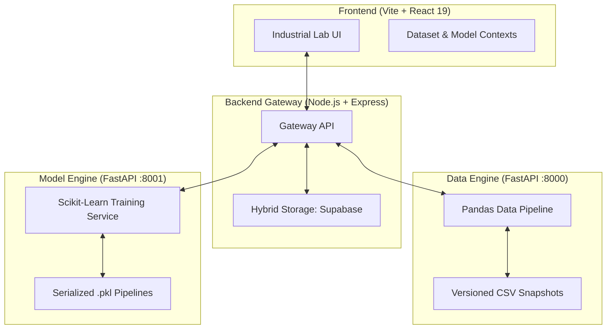

# DataForge Platform — DataPrep Pro v1.0

<p align="center">
  
</p>

[](https://github.com/Venni16/DataForge-Platform)
[](https://github.com/Venni16/DataForge-Platform)
[](https://github.com/Venni16/DataForge-Platform)

**DataForge Platform** is a professional-grade data preprocessing, cleaning, and predictive machine learning suite designed for data scientists and analysts. It features an **Industrial Data Lab** aesthetic and follows a non-destructive, versioned workflow for reliable data preparation and model training.

---

## 🏗️ Architecture Overview

The system utilizes a modern quadruple-tier architecture utilizing an Express.js gateway communicating with distinct Python microservices:



### Technical Stack
- **Frontend**: React 19, Vite, Custom HSL-token Design System, React-Plotly.js.
- **Backend Gateway**: Node.js, Express, Axios, Supabase Client.
- **Data Engine**: Python 3.12, FastAPI, Pandas, Plotly Express (Interactive charts).
- **Model Engine**: Python 3.12, FastAPI, Scikit-learn, Seaborn/Matplotlib, Joblib.
- **Database**: Supabase (PostgreSQL) for metadata, Local Server-Side File Storage for Data & Models.

---

## 🚀 Key Features

### 1. Advanced Transformation Suite
- **Cleaning**: Drop duplicate rows, strictly drop extraneous columns entirely, and remove quantitative outliers (via IQR & Z-Score).
- **Missing Values**: Real-time diagnostic evaluation with advanced batch statistical imputation (Mean, Median, KNN, Iterative Models).
- **Feature Engineering**: Native Categorical Encoding (One-Hot, Label) and robust Feature Scaling (Standard, MinMax, RobustScaler).

### 2. Audit History & Versioning
Every operation mathematically manipulates the dataset and creates a **new versioned snapshot** (v1, v2, v3...).
- **Timeline**: View an exact log of your actions and their impact on shape and missing parameters.
- **Snapshot Preview**: Preview any previous localized dataset version without manual extraction.
- **Rollback**: Revert any transformation (including One-Hot Encoding and Outlier removals) instantly if the output is unsatisfactory.

### 3. Integrated Machine Learning Engine
Perform end-to-end predictive modeling without leaving the UI.
- **Algorithmic Training**: Train highly optimized Classification or Regression models (Random Forest, SVM, Logistic Regression, Decision Trees, KNN, Naive Bayes).
- **Automated Pipeline Protection**: The core backend leverages Scikit-Learn `ColumnTransformer` and `Pipeline` implementations directly inside the `.pkl` files to ensure rigorous prevention against data leakage.
- **Visual Evaluation Dashboard**: Generate dynamically scaled graphical Confusion Matrices and Residual Scatterplots.
- **Live Prediction Test**: Instantly validate predictions inside the dashboard securely through dynamically constructed parameter-grids dynamically injected straight from model properties.

### 4. Interactive Visualizations
- Validate data distributions natively through tightly integrated **Plotly** graphing systems, offering dynamically renderable Histograms, Scatter Plots, Heatmaps, Box Plots, and Pairplots, with custom fallback logic bridging limits of massive data processing.

---

## 🛠️ Installation & Setup

### 1. Data Engine (Python)
Microservice for versioning, imputation, and processing.
```bash
cd data-engine
python -m venv venv
source venv/bin/activate  # Windows: venv\Scripts\activate
pip install -r requirements.txt
uvicorn main:app --reload --port 8000
```

### 2. Model Engine (Python)
Microservice for Training, Evaluation, and Prediction.
```bash
cd model-engine
python -m venv venv
source venv/bin/activate  # Windows: venv\Scripts\activate
pip install -r requirements.txt
uvicorn main:app --reload --port 8001
```

### 3. Backend Gateway (Node.js)
Create a `.env` file in the `backend/` directory:
```env
PORT=3001
DATA_ENGINE_URL=http://localhost:8000
MODEL_ENGINE_URL=http://localhost:8001
SUPABASE_URL=your_url
SUPABASE_SERVICE_KEY=your_key
```
```bash
cd backend
npm install
npm run dev
```

### 4. Frontend (React)
```bash
cd frontend
npm install
npm run dev
```

---

## 🔄 The DataForge Workflow

1. **Upload**: Import CSV or Excel. Metadata dynamically uploads to Cloud Supabase DB while raw logic persists securely on the Data Engine.
2. **Overview**: Audit target metrics including exact missing variables percentages.
3. **Cleanse & Impute**: Target Null elements with machine-learning-informed filling strategies (KNN), and manually sweep away non-correlating parameters safely.
4. **Engineer**: Build categorical encodings natively.
5. **Visualize**: Launch correlation matrices (Heatmaps) analyzing underlying mathematical trends.
6. **Model**: Lock your target column, spin up a predictive algorithm matrix (e.g. Random Forest), evaluate precision and train the live pipeline.
7. **Export**: Automatically download structured `.zip` payloads containing the pristine processed dataset along with a generated Jupyter reproducible notebook framework.

---

## 📜 License & Acknowledgments
Distributed under the **MIT License**. Developed by **Vennilavan Manoharan** for advanced industrial data preparation and predictive modeling workflows.
