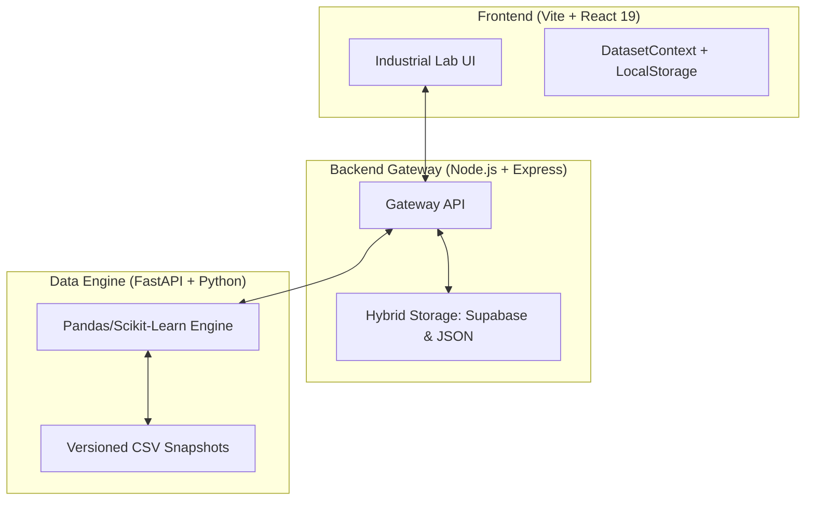

# DataForge Platform — DataPrep Pro v1.0

<p align="center">
  
</p>

[](https://github.com/Venni16/DataForge-Platform)
[](https://github.com/Venni16/DataForge-Platform)

**DataForge Platform** is a professional-grade data preprocessing, cleaning, and visualization suite designed for data scientists and analysts. It features an **Industrial Data Lab** aesthetic and follows a non-destructive, versioned workflow for reliable data preparation.

---

## 🏗️ Architecture Overview

The system utilizes a tri-tier architecture to separate concerns between the UI, the API gateway, and the heavy-duty data processing engine.



### Technical Stack
- **Frontend**: React 19, Vite, Custom HSL-token Design System, React-Plotly.js.
- **Backend Gateway**: Node.js, Express, Axios, Supabase Client.
- **Data Engine**: Python 3.12, FastAPI, Pandas, Scikit-learn, Plotly Express (Interactive charts).
- **Database**: Supabase (PostgreSQL) for metadata, Local Snapshots for CSV storage.

---

## 🚀 Key Features

### 1. Industrial Dataset Library
Manage **10+ datasets** simultaneously. Use the library to switch between active projects, rename datasets, or physically wipe data from the engine.
- **Automatic Persistence**: Page refreshes do not lose your active work session thanks to built-in `localStorage` synchronization.

### 2. Audit History & Versioning
Every operation (cleaning, scaling, encoding) creates a **new versioned snapshot** (v1, v2, v3...).
- **Timeline**: View exactly what happened and when.
- **Snapshot Preview**: Preview any previous version's data without switching.
- **Rollback**: Revert any transformation if results are unsatisfactory.

### 3. Advanced Transformation Suite
- **Cleaning**: Intelligent duplicate removal and outlier detection (IQR & Z-Score).
- **Missing Values**: Real-time diagnostic heatmaps with advanced batch imputation (Mean, Median, KNN, Iterative Models).
- **Feature Engineering**: Categorical Encoding (One-Hot, Label) and robust Feature Scaling (Standard, MinMax, RobustScaler).

### 4. Reproducible Pipeline Export
Convert your entire visual transformation history into a **reproducible Python pipeline script**. This ensures that the exact cleaning steps can be applied in a production ML pipeline.

---

## 🛠️ Installation & Setup

### 1. Data Engine (Python)
```bash
cd data-engine
python -m venv venv
source venv/bin/activate  # Windows: venv\Scripts\activate
pip install -r requirements.txt
uvicorn main:app --reload --port 8000
```

### 2. Backend Gateway (Node.js)
Create a `.env` file in the `backend/` directory:
```env
PORT=3001
DATA_ENGINE_URL=http://localhost:8000
SUPABASE_URL=your_url
SUPABASE_SERVICE_KEY=your_key
```
```bash
cd backend
npm install
npm run dev
```

### 3. Frontend (React)
```bash
cd frontend
npm install
npm run dev
```

---

## 🔄 The DataForge Workflow

1. **Upload**: Import CSV or Excel files. Metadata is synced to the Cloud (Supabase), and the raw file is snapped by the Data Engine.
2. **Overview**: Audit column types and descriptive statistics.
3. **Cleanse**: Detect outliers and fill missing gaps using statistical imputation.
4. **Engineer**: Prepare features for ML models (Scaling/Encoding).
5. **Visualize**: Verify distributions and correlations using both dynamic **interactive Plotly charts** (with custom dark-UI toolbars) and static Seaborn graphics.
6. **Export**: Download the processed CSV and the corresponding Python script.

---

## 📜 License & Acknowledgments
Distributed under the **MIT License**. Developed by **Vennilavan Manoharan** for advanced industrial data preparation workflows.
